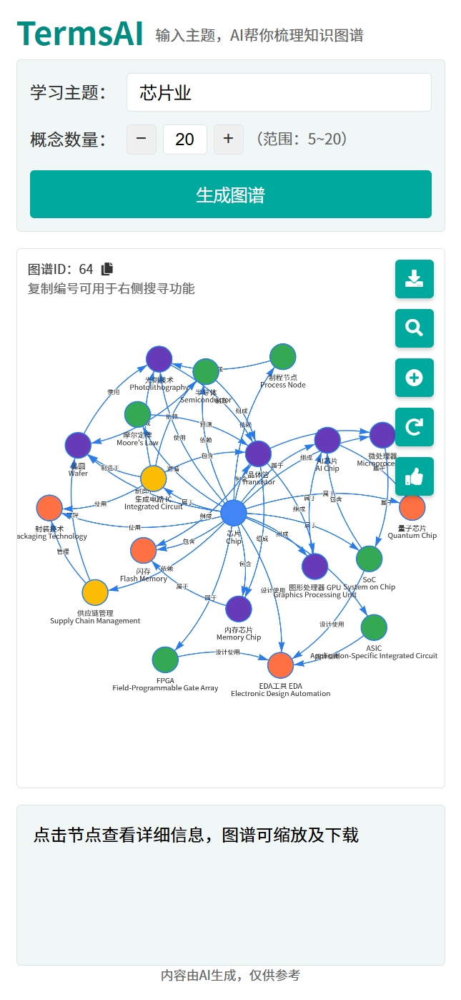
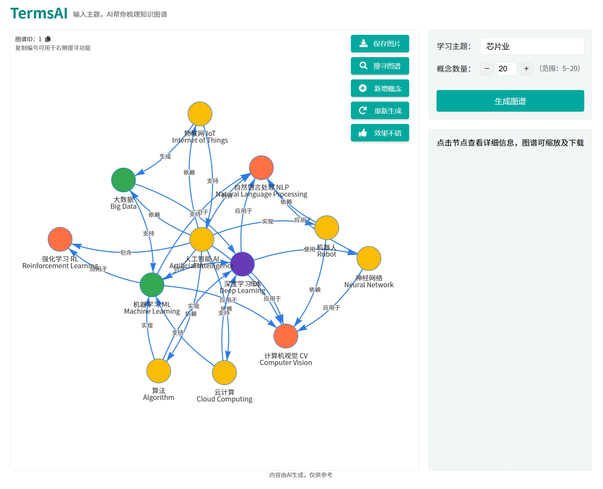

# TermsAI - 智能知识图谱生成工具

## 项目描述

TermsAI是一个基于AI技术的知识图谱生成工具，只需输入学习主题和概念数量，即可自动生成结构化的知识图谱。该工具帮助用户快速梳理特定领域的关键概念及其之间的关系，是学习新知识、备课教学和研究工作的得力助手。

## 主要功能

- **智能图谱生成**：输入主题和所需概念数量，AI自动生成相关概念及其关系
- **可视化呈现**：通过交互式网络图直观展示概念之间的关联
- **概念数量调整**：灵活设置5-20个概念的生成量
- **图谱保存**：一键下载生成的知识图谱为图片
- **图谱搜索**：通过图谱ID查找之前生成的图谱
- **反馈优化**：提供满意度反馈，不满意可重新生成
- **概念扩展**：支持向已有图谱添加新概念

## 技术栈

- **后端**：Python、Flask
- **前端**：HTML、CSS、JavaScript
- **可视化**：vis-network.js
- **数据存储**：SQLAlchemy
- **AI生成**：基于先进的AI大语言模型

## 安装与使用

### 环境要求
- Python 3.7+
- 所需Python包：Flask, SQLAlchemy等

### 安装步骤

1. 克隆仓库到本地
```bash
git clone https://github.com/raphaelxiao/termsai.git
cd termsai
```

2. 安装依赖
```bash
pip install -r requirements.txt
```

3. 设置
- 在.env文件填写大模型API KEY
- 在configs/client.py设置模型（目前是设置了OPENAI的GPT-4o/4o-mini、SilconFlow的DeepSeek-V3/Qwen2.5-72B-Instruct以及阿里云百炼的deepseek-v3）
- 在configs/model_configs.py选择模型

4. 启动应用
```bash
python app.py
```

5. 访问应用
浏览器打开 `http://localhost:5000` 即可使用

## 项目结构

```
termsai/
├── app.py               # 主应用入口和API
├── utils.py             # 工具函数
├── database.py          # 数据库管理
├── models.py            # 数据模型
├── templates/           # HTML模板
│   └── index.html       # 主页面
└── static/              # 静态资源
    ├── css/             # 样式文件
    ├── js/              # JavaScript文件
    └── images/          # 图片资源
```

## 使用展示





## 注意事项

- 应用内容由AI生成，仅供参考
- 对于复杂主题，生成过程可能需要几分钟时间
- 建议使用现代浏览器以获得最佳体验

## 未来计划

- 支持多语言知识图谱生成
- 添加图谱比较功能
- 优化生成速度和质量
- 增加用户自定义样式

## 许可证

MIT

---

欢迎贡献代码，提出建议或报告问题！

---

# TermsAI - Intelligent Knowledge Graph Generation Tool

## Project Description

TermsAI is an AI-powered knowledge graph generation tool that automatically creates structured knowledge graphs by simply inputting a learning topic and the desired number of concepts. This tool helps users quickly organize key concepts and their relationships in a specific field, making it an excellent assistant for learning new topics, preparing lessons, and conducting research.

## Key Features

- **Intelligent Graph Generation**: Input a topic and the number of concepts needed, and the AI will automatically generate related concepts and their relationships.
- **Visualization**: Interactive network diagrams intuitively display the relationships between concepts.
- **Concept Quantity Adjustment**: Flexibly set the number of concepts to generate (5-20).
- **Graph Saving**: Download the generated knowledge graph as an image with one click.
- **Graph Search**: Find previously generated graphs using a graph ID.
- **Feedback Optimization**: Provide satisfaction feedback, and regenerate if unsatisfied.
- **Concept Expansion**: Support adding new concepts to existing graphs.

## Tech Stack

- **Backend**: Python, Flask
- **Frontend**: HTML, CSS, JavaScript
- **Visualization**: vis-network.js
- **Data Storage**: SQLAlchemy
- **AI Generation**: Based on advanced large language models

## Installation and Usage

### Environment Requirements
- Python 3.7+
- Required Python packages: Flask, SQLAlchemy, etc.

### Installation Steps

1. Clone the repository to your local machine.
```bash
git clone https://github.com/your-username/termsai.git
cd termsai
```

2. Install dependencies.
```bash
pip install -r requirements.txt
```

3. Start the application.
```bash
python app.py
```

4. Access the application.
Open your browser and visit `http://localhost:5000` to use the tool.

## Project Structure

```
termsai/
├── app.py               # Main application entry and API
├── utils.py             # Utility functions
├── database.py          # Database management
├── models.py            # Data models
├── templates/           # HTML templates
│   └── index.html       # Main page
└── static/              # Static resources
    ├── css/             # Style files
    ├── js/              # JavaScript files
    └── images/          # Image resources
```

## Usage Demonstration


## Notes

- The content generated by the application is for reference only.
- For complex topics, the generation process may take a few minutes.
- It is recommended to use modern browsers for the best experience.

## Future Plans

- Support multi-language knowledge graph generation.
- Add graph comparison functionality.
- Optimize generation speed and quality.
- Allow user-defined styles.

## License

MIT

---

**Contributions are welcome! Feel free to contribute code, suggest ideas, or report issues!**
